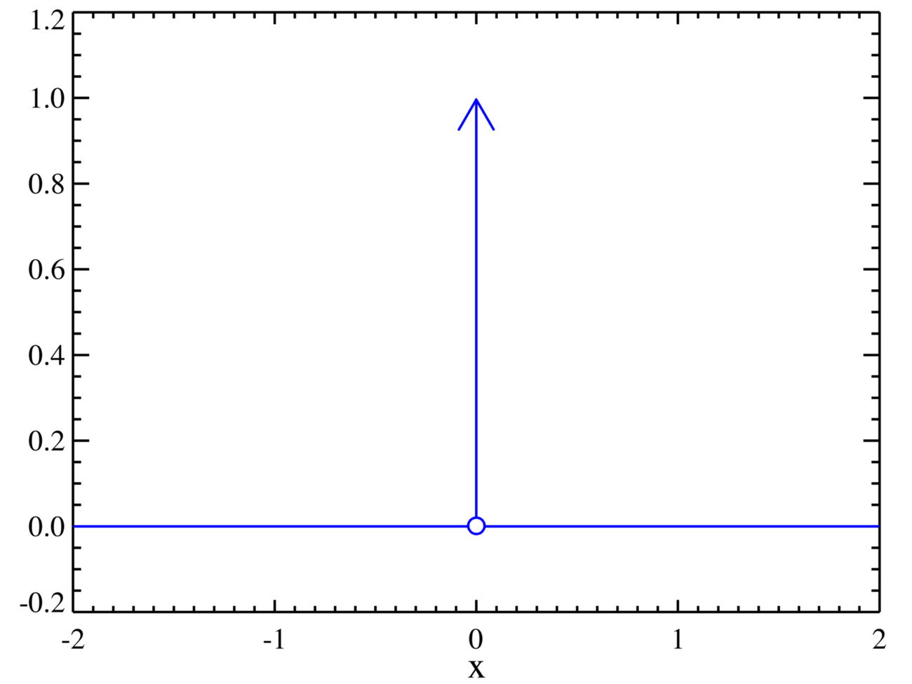
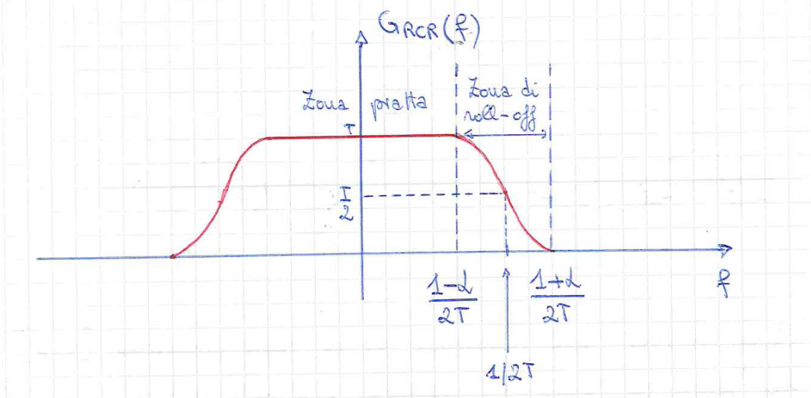
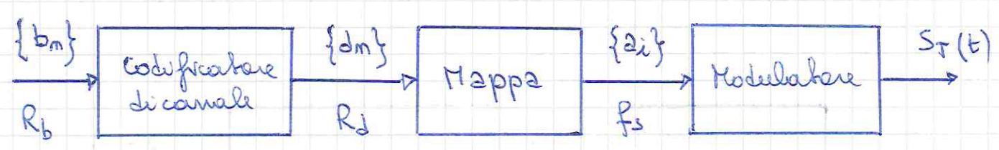

## Segnali Notevoli

### Rettangolo

> Rettangolo di altezza $A$ e lunghezza $T$ centrato nell'origine.

$$A\cdot\text{rect}\left(\frac{t}{T}\right)$$

### Seno Cardinale

> $\sin(t)$ smorzato che si annulla in $t\pi : t \in \mathbb{Z}$

$$\text{sinc}(t)=\cfrac{\sin(\pi t)}{\pi t}$$

### Gradino

$$u(t) = \begin{cases}1 \quad& t\ge 0 \newline 0\quad& t < 0\end{cases} \quad= \int\limits_{-\infty}^t\delta(\tau)d\tau $$

### Delta Di Dirac

> Funzione impulso ad area unitaria

$$\delta(t)$$

{ width="400" }

### Funzione Segno

$$\text{sgn}(t) = \begin{cases}1 \quad& t\ge 0 \newline -1\quad& t < 0\end{cases}$$

### Impulso A Coseno Rialzato

|$G_{RCR}(f)$|$g_{RCR}(t)$|
|:-:|:-:|
|{ width="400" }|$\text{sinc}(t/T)\cdot\cfrac{\cos(\alpha\pi t/T)}{1-(2\alpha t/T)^2}$|

---

## Grandezze Energetiche

- Potenza Istantanea

$$P_x = |x(t)|^2$$

- Energia

$$E_x = \int\limits_{-\infty}^\infty P_x(t)dt = \int\limits_{-\infty}^\infty|x(t)|^2dt$$

- Potenza Media

$$P_x=\lim\limits_{T\to\infty}\frac{1}{T}\int_{-\frac{T}{2}}^{\frac{T}{2}}|x(t)|^2dt$$

- Valore Efficace

$$x_{eff} = \sqrt{P_x}$$

- Valore Medio

$$x_m = \lim\limits_{T\to\infty}\frac{1}{T}\int_{-\frac{T}{2}}^{\frac{T}{2}}x(t)dt$$

- Densità spettrale

: Dato un generico segnale $x_T(t)=x(t)\cdot \text{rect}(t/T)$ ad energia finita

$$\begin{align}
\notag \text{Densità spettrale di energia:}\quad& E_{X_T}(f)=|X_T(f)|^2 \newline
\notag \text{Densità spettrale di potenza:}\quad& S_X(f)=\lim\limits_{T\rarr\infin}\cfrac{|X_T(f)|^2}{T}
\end{align}$$

---

## Trasformate Di Fourier

### Trasormata Serie di Fourier

$$\large\begin{align}
\notag \text{Equazione di sintesi:}\quad& x(t)=\sum\limits_{k=-\infty}^{\infty}X_ke^{j2\pi kf_0t} \newline
\notag \text{Equazione di analisi:}\quad& X_k= \cfrac{1}{T_0}\int_{-\frac{T_0}{2}}^{\frac{T_0}{2}}x(t)e^{-j2\pi kf_0t}dt
\end{align}$$

### Trasormata Continua di Fourier

$$\large\begin{align}
\notag \text{Equazione di sintesi:}\quad& x(t)=\int\limits_{-\infty}^{\infty}X(f)e^{j2\pi ft}df \newline
\notag \text{Equazione di analisi:}\quad& X(f)=\int\limits_{-\infty}^{\infty}x(t)e^{-j2\pi ft}dt
\end{align}$$

### Trasormata Discreta di Fourier

$$\large\begin{align}
\notag \text{Equazione di sintesi:}\quad& x[n]=T\int_{-\frac{1}{2T}}^{\frac{1}{2T}}
\overline{X}(f)e^{j2\pi nft}df \newline
\notag \text{Equazione di analisi:}\quad& \overline{X}(f)=\sum\limits_{n=-\infty}^{\infty}x[n]e^{-j2\pi nf_0t}
\end{align}$$

---

## Trasformate Notevoli

|$x(t)$|$X(F)$|
|:-:|:-:|
|$u(t)$|$\frac{1}{2}\;\delta(f)+\frac{1}{j2\pi f}$|
|$\delta(t)$|$1$|
|$\text{rect}\left(\frac{t}{T}\right)$|$T\;\text{rect}(fT)$|
|$\cos(2\pi f_0t)$|$\frac{\delta(f-f_0)}{2}+\frac{\delta(f+f_0)}{2}$|
|$\sin(2\pi f_0t)$|$\frac{\delta(f-f_0)}{2j}+\frac{\delta(f+f_0)}{2j}$|

---

## Teoremi

### Teorema della linearità

$$\large x(t)=ax_1(t)+bx_2(t) \newline
\Updownarrow \newline
X(f)=aX_1(f)+bX_2(f)$$

??? abstract "Dimostrazione"
    $$\begin{align}
    \notag X(f) &= \int\limits_{-\infty}^{\infty}x(t)e^{-j2\pi ft}dt \newline
    \notag &= \int\limits_{-\infty}^{\infty}(ax_1(t)+bx_2(t))e^{-j2\pi ft}dt \newline
    \notag &= a\int\limits_{-\infty}^{\infty}x_1(t)e^{-j2\pi ft}dt + b\int\limits_{-\infty}^{\infty}x_2(t)e^{-j2\pi ft}dt \newline
    \notag &= aX_1(f)+bX_2(f)
    \end{align}$$

### Teorema della dualità

$$\large x(t)\leftrightharpoons X(f)\newline
\Updownarrow \newline
X(t)\leftrightharpoons x(-f)
$$

??? abstract "Dimostrazione"
    Parto dall'equazione di sintesi

    $$x(t)=\int\limits_{-\infty}^{\infty}X(f)e^{j2\pi ft}df$$

    Scambio le variabili $t$ e $f$

    $$x(f)=\int\limits_{-\infty}^{\infty}X(t)e^{j2\pi tf}dt$$

    Sostituisco la variabile $f$ con $-f$

    $$x(-f)=\int\limits_{-\infty}^{\infty}X(t)e^{-j2\pi tf}dt$$

    Che corrisponde all'equazione di analisi

### Teorema del ritardo

$$\large x(t-t_0)\leftrightharpoons X(f)e^{-j2\pi ft_0}$$

??? abstract "Dimostrazione"
    Partendo dalla definizione di trasformata

    $$\cal{F}\\{x(t-t_0)\\} = \int\limits_{-\infty}^{\infty}x(t-t_0)e^{-j2\pi ft}dt$$

    Si effettua un cambiamento di variabile $\alpha=t-t_0$

    $$\begin{align}
    \notag \cal{F}\\{x(t-t_0)\\} = &\leftrightharpoons\int\limits_{-\infty}^{\infty}x(\alpha)e^{-j2\pi f(\alpha+t_0)}d\alpha \newline
    \notag &\leftrightharpoons e^{-j2\pi ft_0}\int\limits_{-\infty}^{\infty}x(\alpha)e^{-j2\pi f\alpha}d\alpha \newline
    \notag &\leftrightharpoons X(f)e^{-j2\pi ft_0}
    \end{align}$$

### Teorema della modulazione

$$\large x(t)\cos(2\pi f_0t)\leftrightharpoons\cfrac{X(f-f_0)+X(f+f_0)}{2}$$

??? abstract "Dimostrazione"
    $$\begin{align}
    \notag \cal{F}\\{x(t)\cos(2\pi f_0t)\\} &= \int\limits_{-\infty}^{\infty}x(t)\cos(2\pi f_0t)e^{-j2\pi ft}dt \newline
    \notag &= \int\limits_{-\infty}^{\infty}x(t)\cfrac{e^{j2\pi f_0t}+e^{-j2\pi f_0t}}{2} \cdot e^{-j2\pi ft}dt \newline
    \notag &= \cfrac{1}{2}\int\limits_{-\infty}^{\infty}x(t)e^{-j2\pi (f-f_0)t}dt+\cfrac{1}{2}\int\limits_{-\infty}^{\infty}x(t)e^{-j2\pi (f+f_0)t}dt \newline
    \notag &=\cfrac{1}{2}\cdot X(f-f_0)+\cfrac{1}{2}\cdot X(f+f_0)
    \end{align}$$

### Teorema della derivazione

$$\large x(t)\leftrightharpoons X(f)\newline
\Updownarrow \newline
\cfrac{dx(t)}{dt} \leftrightharpoons j2\pi f \cdot X(f)
$$

??? abstract "Dimostrazione"
    Partento dal segnale $x(t)$ come trasformata di $X(f)$
    
    $$x(t) = \int\limits_{-\infty}^{\infty}X(f)e^{j2\pi ft}df$$
    
    Derivandolo otteniamo
    
    $$\begin{align}
    \notag \cfrac{dx(t)}{dt} &= \cfrac{d}{dt}\int\limits_{-\infty}^{\infty}X(f)e^{j2\pi ft}df \newline
    \notag &= \int\limits_{-\infty}^{\infty}\cfrac{d}{dt}\left[X(f)e^{j2\pi ft}\right]df \newline
    \notag &= \int\limits_{-\infty}^{\infty}X(f)\cfrac{d}{dt}e^{j2\pi ft}df \newline
    \notag &= \int\limits_{-\infty}^{\infty}X(f)(j2\pi f)e^{j2\pi ft}df
    \end{align}$$

### Teorema dell'integrazione

$$\large x(t)\leftrightharpoons X(f)\newline
\Updownarrow \newline
\int\limits_{-\infty}^{t} x(\alpha)d\alpha\leftrightharpoons \cfrac{X(f)}{j2\pi f}
$$

??? abstract "Dimostrazione"
    Partendo dal segnale $y(t)$
    
    $$y(t)=\int\limits_{-\infty}^{t} x(\alpha)d\alpha$$
    
    Poichè $x(t)=dy(t)/dt$, possiamo usare il teorema della derivazione
    
    $$X(f)=j2\pi fY(f)$$
    
    Da cui si ricava
    
    $$Y(f)=\cfrac{X(f)}{j2\pi f}$$

### Teorema dell'integrazione completo

$$\large x(t)\leftrightharpoons X(f)\newline
\Updownarrow \newline
\int\limits_{-\infty}^{t} x(\alpha)d\alpha\leftrightharpoons \cfrac{X(f)}{j2\pi f} + \cfrac{X(0)}{2}\delta(f)
$$

### Teorema del prodotto

$$\large z(t)=x(t)\cdot y(t)\newline
\Updownarrow \newline
Z(f) = X(f)\otimes Y(f)
$$

??? abstract "Dimostrazione"
    $$\begin{align}
    \notag Z(f) &= \int\limits_{-\infty}^{\infty}z(t)e^{-j2\pi ft}dt \newline
    \notag &= \int\limits_{-\infty}^{\infty}x(t)y(t)e^{-j2\pi ft}dt \newline
    \notag &= \int\limits_{t=-\infty}^{\infty}\left[\int\limits_{v=-\infty}^{\infty}X(v)e^{j2\pi vt}dv\right]y(t)e^{-j2\pi ft}dt \newline
    \notag &= \int\limits_{v=-\infty}^{\infty}X(v)\left[\int\limits_{t=-\infty}^{\infty}y(t)e^{-j2\pi (f-v)t}dt\right]dv \newline
    \notag &= \int\limits_{v=-\infty}^{\infty}X(v)Y(f-v)dv \newline
    \notag &= X(f)\otimes Y(f)
    \end{align}$$

### Teorema di Parseval

$$\large \int\limits_{-\infin}^\infin|x(t)|^2dt = \int\limits_{-\infin}^\infin\left|X(f)\right|^2df$$

??? abstract "Dimostrazione"
    $$\begin{align}
    \notag E_x &= \int\limits_{-\infin}^\infin|x(t)|^2dt \newline 
    \notag &= \int\limits_{-\infin}^\infin x(t)\cdot x^{\*}(t)dt \newline
    \notag &= \int\limits_{t=-\infin}^\infin x(t)\left[\int\limits_{f=-\infin}^\infin X^{\*}(f) e^{-j2\pi ft}df\right]dt\newline
    \notag &= \int\limits_{f=-\infin}^\infin X^{\*}(f)\left[\int\limits_{t=-\infin}^\infin x(t) e^{-j2\pi ft}dt\right]df\newline
    \notag &= \int\limits_{f=-\infin}^\infin X^{\*}(f)X(f)df \newline
    \notag &= \int\limits_{-\infin}^\infin |X(f)|^2df
    \end{align}$$

### Prima formula di Poisson

Evidenzia che periodicizzare nel tempo una funzione aperiodica e uguale a campionare in frequenza ad intervallid $T_0$

$$\large\sum\limits_{n=-\infty}^{+\infty}x(t-nT_0)=\sum\limits_{k=-\infty}^{+\infty}\cfrac{1}{T_0}\cdot X\left(\cfrac{k}{T_0}\right)e^{j\frac{2\pi kt}{T_0}}$$

---

## Sistemi Monodimenzionali

Un sistema è una trasformazione che ad un segnale di ingresso $x(t)$ fa corrispondere un ben determinato segnale d'uscita $y(t)$. La trasformazione del segnale $x(t)$ nel segnale $y(t)$ si denota nel modo seguente:

$$y(t)=T[x(t)] = x(t) \otimes h(t)$$

$h(t)$ è la risposta impulsiva:

$$h(t) = T[\delta(t)]$$

### Proprietà

- **Stazionarietà**
: Un sistema è stazionario se le caratteristiche del sistema non variano nel tempo.
- **Causalità**
: Un sistema è causale quando il valore dell'uscita all'istante arbitrario generico $t$ dipende soltanto dai valori assunti dall'ingresso agli istanti precedenti (o al limite coincidenti con) $t$ stesso.
- **Memoria**
: Un sistema è con memorio se iIl calcolo del valore dell'uscita all'istante $t$ presuppone la conoscenza dell'andamento del segnale degli istanti precedenti.
- **Stabilità**
: Un sistema è stabile se, sollecitato da un segnale con andamento arbitrario ma di ampiezza limitata, produce a sua volta in uscita un segnale di ampiezza limitata.
- **Invertibilità**
: Un sistema è invertibile se è possibile ricostruire il segnale di eccitazione in ingresso a un sistema se è nota la risposta al segnale stesso
- **Linearità**
: Un sistema è lineare se a esso è applicabile il principio di sovrapposizione degli effetti.

### Sistemi in cascata

$$\begin{align}
\notag \text{Risposta Impulsiva:}\quad& h(t) = h_1(t)\otimes h_2(t) \newline
\notag \text{Risposta in Frequenza:}\quad& H(f) = H_1(f)\cdot H_2(f)
\end{align}$$

### Sistemi in parallelo

$$\begin{align}
\notag \text{Risposta Impulsiva:}\quad& h(t) = h_1(t)+ h_2(t) \newline
\notag \text{Risposta in Frequenza:}\quad& H(f) = H_1(f)+ H_2(f)
\end{align}$$

---

## Filtri

### Filtro Passa Basso

$$\begin{align}
\notag \text{Risposta in Frequenza:}\quad& H_{LP}(f) = \text{rect}\left(\frac{f}{2B}\right) \newline
\notag \text{Risposta Impulsiva:}\quad& h_{LP}(t) = 2B\text{sinc}(2Bt)
\end{align}$$

### Filtro Passa Alto

$$\begin{align}
\notag \text{Risposta in Frequenza:}\quad& H_{HP}(f) = 1 - H_{LP}(f) \newline
\notag \text{Risposta Impulsiva:}\quad& h_{HP}(t) = \delta(t) - h_{LP}(t)
\end{align}$$

### Filtro Passa Banda

$$\begin{align}
\notag \text{Risposta in Frequenza:}\quad& H_{BP}(f) = H_{LP}(f+f_0) + H_{LP}(f-f_0) \newline
\notag \text{Risposta Impulsiva:}\quad& h_{BP}(t) = h_{LP}\cos(2\pi f_0t)
\end{align}$$

### Filtro Elimina Banda

$$\begin{align}
\notag \text{Risposta in Frequenza:}\quad& H_{BS}(f) = 1 -  H_{BP}(f) \newline
\notag \text{Risposta Impulsiva:}\quad& h_{BS}(t) = \delta(t) - h_{BP}(t)
\end{align}$$

---

## Nyquist

### Condizioe di Nyquist

Campionando un segnale analogico con frequenza di campionamento $f_c = \frac{1}{T} \ge 2B$ otteniamo copie distinte, non distorte e di periodo $\frac{1}{T}$ dello spettro frequenziale $X(f)$

### Teorema del Campionamento

Un segnale il cui spettro è limitato nella banda $B$ può essere ricostruito esattamente a partire dai propri campioni, purchè la frequenza di campionamento non sia inferiore a $2B$ (condizione di Nyquist), mediante un interpolatore cardinale $p(t) = \text{sinc}(t/T)$:

$$x(t)=\sum\limits_{n}^{\infin}x[n]\cdot\text{sinc}\left(\cfrac{t-nT}{T}\right)$$

??? abstract "Dimostrazione"
    Sappiamo che:
    $$\begin{align}
    \notag\overline{X}(f)&= \sum\limits_{n=-\infin}^{\infin}x[n]e^{-j2\pi nf_0t} \\
    \notag &= \cfrac{1}{T}\sum\limits_{k=-\infin}^{\infin}X\left(f-\cfrac{k}{T}\right)
    \end{align}$$
    Che equivale a periodicizzare in frequenza il segnale x(t). Al fine di ottenere il segnale originale $x(t)$ e sufficiente filtrare in frequenza con $P(f) = T\text{ rect}(fT)$:
    $$\begin{align}
    \notag \^X(f) &= P(f) \cdot \overline{X}(f) \\
    \notag &= T\text{ rect}(fT) \cdot \cfrac{1}{T}\sum\limits_{k=-\infin}^{\infin}X\left(f-\cfrac{k}{T}\right) \\
    \notag &= X(f)
    \end{align}$$
    Valida ovviamente nelle ipotesi che:

    - $x(t)$ abbia banda limitata $B$
    - Sia stata rispettata la condizione di Nyquist $f_c\ge2B$

    La cui antitrasformata equivale:
    $$x(t)=\sum\limits_{n}^{\infin}x[n]\cdot\text{sinc}\left(\cfrac{t-nT}{T}\right)$$

---

## Teoria della Probabilità

### Definizioni

- Spazio Campione ($\Omega$)
: Insieme di tutti i possibili risultati di un esperimento.

- Evento (S)
: Sottoinsieme dello spazio campione.

- Legge di probabilità ($Pr(\cdot)$):
: Legge che associa ad ogni evento una misura della sua probabilità.

- Probabilità condizionata
: $Pr(A|B) = \cfrac{Pr(A\cap B)}{Pr(B)}$

- Regola di Bayes
: $Pr(A|B) = \cfrac{Pr(B|A)\;Pr(A)}{Pr(B)}$

- Legge della probabilità totale
: $Pr(A) = \sum\limits_{i=1}^{N}Pr(A|B_i)\cdot Pr(B_i)$

---

## Variabili aleatorie

### Definizioni

- Funzione distribuzione
: $F_X(x) = Pr(X\le x)$

- Funzione densità di probabilità
: $f_X(x) = \cfrac{dF_X(x)}{dx}$

- Funzione distribuzione (variabili multiple)
: $F_{X,Y}(x,y) = Pr(X\le x, Y\le y)$

- Funzione densità di probabilità (variabili multiple)
: $f_{X,Y}(x,y) = \cfrac{d^2F_{X,Y}(x,y)}{dxdy}$

- Funzione probabilità condizionata
: $f_Y(y|x) = \cfrac{f_{X,Y}(x,y)}{f_X(x)}$

- Valore medio
: $\mu_X = \mathbb{E}[X] = \int\limits_{-\infin}^{\infin}x\;f_X(x)dx$

- Varianza
: $\sigma_X^2 = \int\limits_{-\infin}^{\infin}(x-\eta_{X})^2f_X(x)dx = E[X^2] - \mu_X^2$

- Deviazione standard
: $\sigma_X = \sqrt{\sigma_X^2}$

- Covarianza
: $c_{XY} = \mathbb{E}[XY]-\mu_X\mu_Y$

- Coefficiente di correlazione
: $\rho_{XY} = \cfrac{c_{XY}}{\sigma_X\sigma_Y}$

### Somma di variabili aleatorie indipendenti

Se $X$ e $Y$ sono 2 variabili aleatorie statisticamente indipendenti e con densità di probabilità $f_X(x)$ e $f_Y(y)$ allora si definisce $Z=X+Y$ la cui funzione densità di probabilità:

$$
f_Z(z) = f_X(x) \otimes f_Y(y)
$$

### Densità di probabilità composta

Data una variabili aleatoria $X$ la cui funzione distribuzione di probabilità è $f_X(x)$ allora:

$$\begin{align}
\notag Pr(x_1\le X \le x_2) &= Pr(X \le x_2) - Pr(X \le x_1) \newline
\notag &= F_X(x_1) - F_X(x_2) \newline
\notag &= \int_{x_1}^{x_2} f_X(x) dx
\end{align}$$

### Variabile aleatoria Gaussiana

Una vartiabile eleatoria $X$ è Gaussiana se la sua funzione densità di probabilità è: 

$$f_X(x) = \cfrac{1}{\sqrt{2\pi\sigma_X^2}}\cdot e^{-\cfrac{(x-\mu_X)^2}{2\sigma_X^2}}$$

$X \in \cal{N}(\mu_X,\sigma_X^2)$

Una variabile aleatoria Gaussiana $N$ è standard se:

$$N\in\cal{N}(0,1)$$

$$f_N(n) = \cfrac{1}{\sqrt{2\pi}}\cdot e^{-\cfrac{n^2}{2}}$$

#### Proprietà

Data una variabile aleatoria $X \in \cal{N}(\mu_X,\sigma_X^2)$ definiamo $Y=aX+b$, allora:

- valore medio
: $\mu_Y = a\mu_X+b$

- varianza
: $\sigma_Y^2 = a^2\cdot\sigma_X^2$

### Teorema del valore centrale

Siano $X_1,\ldots, X_n$ una sequenza di variabili aleatorie indipendenti e identicamente distribuite con valore medio $\mu$ e varrianza $\sigma$:
$$Y_n = \frac{1}{\sigma\sqrt{n}}\left(\sum\limits_{i=1}^n X_i-n\mu\right)$$

al tendere di $n$ all'infinito, $Y_n$ converge alla variabile aleatoria Gaussiana standard.

## Processi stocastici

### Definizioni
- valore medio
: $\mu_X = \mathbb{E}[X(t)] = \int\limits_{-\infty}^{\infty}xf_{X}(t)dt$

- autocorrelazione
: $R_{XY} = \mathbb{E}[XY] = \int\limits_{-\infty}^{\infty}\int\limits_{-\infty}^{\infty} xyf_{XY}(x,y)dxdy$

### Sistemi Stazionari in senso lato (SSL)

Un processo stocastico $X(t)$ si dice Stazionario in Senso Lato (SSL)
se:

- Il valore medio del processo $X(t)$ é costante $\forall t$
- La funzione di autocorrelazione del processo $X(t)$ dipende
    solamente dalla differenza tra la differenza tra due tempi qualsiasi
    al quale il processo é campionato

#### Risposta del sistema SSL

- Valor medio
: $\mu_Y= \mu_X H(0)$

- Autocorrelazione
: $R_{Y} = R_{X} \otimes h(t_1)\otimes h(t_2)$

### Processo Gaussiano

Un processo $Y(t)$ é detto processo Gaussiano se la variabile
aleatoria $Y$ é una variabile aleatoria a distribuzione Gaussiana:
$$f_{Y(y)} = \frac{1}{\sqrt{2\pi\sigma^2}}e^{\left(\displaystyle-\frac{(y-\mu)^2}{2\sigma^2}\right)}$$

---

## Sistemi di comunicazione numerici

- $\\{b_n\\}$: sequenza dei bit in uscita dalla sorgente
- $\\{d_n\\}$: sequenza dei bit di codice
- $\\{a_i\\}$: sequenza dei simboli appartenenti ad un alfabeto di $M$ diversi simboli

Il periodo $T$ tra due *simboli* adiacenti viene detto "Intervallo di Segnalazione". 
Se $M=2^Q$ allora: 

$$T = QT_d =T_d log_{2}(M)$$ 

la velocitá di trasmissione dei simboli $f_s = \frac{1}{T}$ é legata al rate $R_d$ da: 

$$f_s = \frac{R_d}{Q} = \frac{R_d}{log_{2}(M)}$$ 

la banda impiegata sará: $$B_T \simeq \frac{1}{T}$$

### PAM

