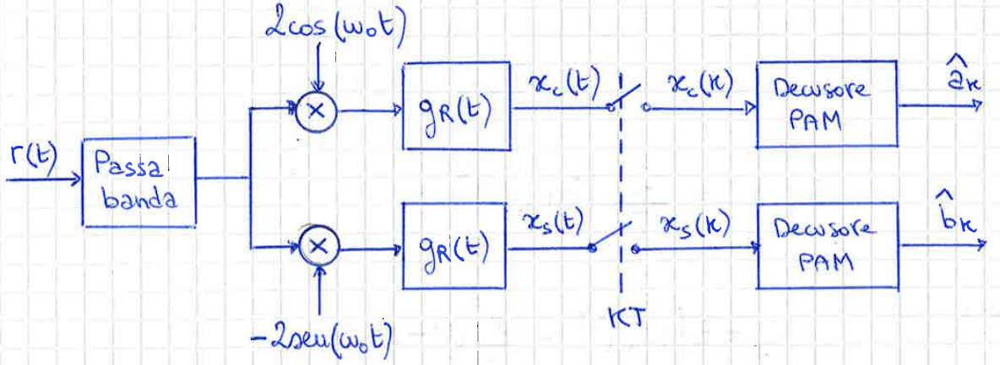

## Segnali Notevoli

### Costante

$$x(t)=A\quad\forall t$$

- $E_x = \int\limits_{-\infty}^\infty A^2 dt = \infty$
- $P_x = \lim\limits_{T\to\infty}\frac{1}{T}\int_{-\frac{T}{2}}^{\frac{T}{2}}A^2dt = A^2$
- $x_{eff} = |A|$
- $x_m = \lim\limits_{T\to\infty}\frac{1}{T}\int_{-\frac{T}{2}}^{\frac{T}{2}}A\;dt = A$

### Sinusoide

$$x(t) = Acos(2\pi f_0\;t + \phi)$$

- $E_x = \int\limits_{-\infty}^\infty |x(t)|^2 dt = \infty$
- $P_x = \lim\limits_{T\to\infty}\frac{1}{T}\int_{-\frac{T}{2}}^{\frac{T}{2}}|x(t)|^2dt = \frac{A^2}{2}$
- $x_{eff} = \frac{|A|}{\sqrt{2}}$
- $x_m = \lim\limits_{T\to\infty}\frac{1}{T}\int_{-\frac{T}{2}}^{\frac{T}{2}}x(t)dt = 0$

### Gradino

$$u(t) = \begin{cases}1 \quad& t\ge 0 \newline 0\quad& t < 0\end{cases} \quad= \int\limits_{-\infty}^t\delta(\tau)d\tau $$

- $E_x = \int\limits_{-\infty}^\infty u^2(t) dt = \infty$
- $P_x = \lim\limits_{T\to\infty}\frac{1}{T}\int_{-\frac{T}{2}}^{\frac{T}{2}}u^2(t)dt = \frac{1}{2}$

### Rettangolo

> Rettangolo di altezza $A$ e lunghezza $T$ centrato nell'origine.

$$x(t) = A\cdot\text{rect}\left(\frac{t}{T}\right) = \begin{cases}A \quad& -\frac{T}{2}\le t\le \frac{T}{2} \newline 0\quad& \text{altrove}\end{cases}$$

- $E_x = \int\limits_{-\infty}^\infty x^2(t) dt = A^2T$
- $P_x = \lim\limits_{T_0\to\infty}\frac{1}{T_0}\int_{-\frac{T_0}{2}}^{\frac{T_0}{2}}x^2(t)dt = 0$

### Esponenziale unilatero

$$x(t) = e^{-t}\cdot u(t)$$

- $E_x = \int\limits_{-\infty}^\infty x^2(t) dt = \frac{1}{2}$
- $P_x = \lim\limits_{T\to\infty}\frac{1}{T}\int_{-\frac{T}{2}}^{\frac{T}{2}}x^2(t)dt = 0$

### Esponenziale bilatero

$$x(t) = e^{-|t|}$$

- $E_x = \int\limits_{-\infty}^\infty x^2(t) dt = 1$
- $P_x = \lim\limits_{T\to\infty}\frac{1}{T}\int_{-\frac{T}{2}}^{\frac{T}{2}}x^2(t)dt = 0$

### Funzione Segno

$$x(t) = \text{sgn}(t) = \begin{cases}1 \quad& t\ge 0 \newline -1\quad& t < 0\end{cases}$$

- $E_x = \int\limits_{-\infty}^\infty x^2(t) dt = \infty$
- $P_x = \lim\limits_{T\to\infty}\frac{1}{T}\int_{-\frac{T}{2}}^{\frac{T}{2}}x^2(t)dt = 1$

### Seno Cardinale

> $\sin(t)$ smorzato che si annulla in $t\pi : t \in \mathbb{Z}$

$$\text{sinc}(t)=\cfrac{\sin(\pi t)}{\pi t}$$

### Delta Di Dirac

> Funzione impulso ad area unitaria

$$\delta(t) = \lim\limits_{\epsilon\to\infty}\frac{1}{\epsilon}\cdot\text{rect}\left(\frac{t}{\epsilon}\right)$$

{ width="400" }

### Impulso A Coseno Rialzato

|$G_{RCR}(f)$|$g_{RCR}(t)$|
|:-:|:-:|
|{ width="400" }|$\text{sinc}(t/T)\cdot\cfrac{\cos(\alpha\pi t/T)}{1-(2\alpha t/T)^2}$|

---

## Grandezze Energetiche

- Potenza Istantanea

$$P_x(t) = |x(t)|^2$$

- Energia

$$E_x = \int\limits_{-\infty}^\infty P_x(t)dt = \int\limits_{-\infty}^\infty|x(t)|^2dt = \int\limits_{-\infty}^\infty|X(f)|^2dt$$

!!! Note
    - Energia finita: Segnali fisici
    - Energia infinita: Segnali ideali

- Potenza Media

$$P_x=\lim\limits_{T\to\infty}\frac{1}{T}\int_{-\frac{T}{2}}^{\frac{T}{2}}|x(t)|^2dt$$

- Valore Efficace

$$x_{eff} = \sqrt{P_x}$$

- Valore Medio

$$x_m = \lim\limits_{T\to\infty}\frac{1}{T}\int_{-\frac{T}{2}}^{\frac{T}{2}}x(t)dt$$

- Densità spettrale

: Dato un generico segnale $x_T(t)=x(t)\cdot \text{rect}(t/T)$ ad energia finita

$$\begin{align}
\notag \text{Densità spettrale di energia:}\quad& E_{X_T}(f)=|X_T(f)|^2 \newline
\notag \text{Densità spettrale di potenza:}\quad& S_X(f)=\lim\limits_{T\rarr\infin}\cfrac{|X_T(f)|^2}{T}
\end{align}$$

### Correlazione tra segnali periodici

- Correlazione
: $C_{x,y}(\tau) = \int\limits_{-\infty}^\infty x(t)\cdot y^{*}(t-\tau) dt$

- Autocorrelazione
: $C_x(\tau) = \int\limits_{-\infty}^\infty x(t)\cdot x^{*}(t-\tau) dt$

??? note "Proprietà autocorrelazione"
    - Energia
    : $$\begin{align}
    \notag C_x(0) &= \int\limits_{-\infty}^\infty x(t)\cdot x^{*}(t) dt \newline
    \notag &= \int\limits_{-\infty}^\infty |x(t)|^2 dt \newline
    \notag &= E_x
    \end{align}$$

    - Simmetria Hermitiana
    : $$C_x^{*}(\tau) = C_x(-\tau)$$
    
    - TCF dell'autocorrelazione
    $$\begin{align}
    \notag S_x(f) &= \cal{F}\left\\{C_x(\tau)\right\\} \newline
    \notag &= \int\limits_{-\infty}^{\infty} C_x(\tau)\;e^{-j2\pi f\tau}d\tau \newline
    \notag &= \int\limits_{\tau=-\infty}^{\infty} \left(\int\limits_{t=-\infty}^\infty x(t)\cdot x^{*}(t-\tau) dt\right) e^{-j2\pi f\tau} d\tau \newline
    \notag &= \int\limits_{t=-\infty}^\infty x(t) \left(\int\limits_{\tau=-\infty}^{\infty} x^{\*}(t-\tau) e^{-j2\pi f\tau} d\tau \right) dt 
    \end{align}$$
    Scambio $t-\tau$ con $\tau'$
    $$\begin{align}
    \notag S_x(f) &= \int\limits_{t=-\infty}^\infty x(t) \left(\int\limits_{\tau'=-\infty}^{\infty} x^{\*}(\tau') e^{-j2\pi f(t-\tau')} d\tau' \right) dt \newline
    \notag  &= \int\limits_{-\infty}^{\infty} x(t) e^{-j2\pi ft} dt \int\limits_{-\infty}^{\infty} x^{\*}(\tau') e^{j2\pi f\tau'} d\tau' \newline
    \notag &= X(f)X^{\*}(f) \newline
    \notag &= |X(f)|^2
    \end{align}$$

- Densità spettrale di energia
: $S_x(f) = |X(f)|^2$

## Grandezze Energetiche TDF

- Autocorrelazione
: $R_x[m] = \sum\limits_{n=-\infty}^{\infty}x[n]x^{\*}[n-m]$

- Densità spettrale di energia
: $\overline{S}_x(f) = TDF[R_x[m]] = |\overline{X(f)}|^2$

- Energia
: $E_x = T\int\limits_{-\infty}^\infty \overline{S}_x(f)df$
: $= \sum\limits_{n=-\infty}^{\infty}|x[n]|^2dt$

---

## Trasformate Di Fourier

### Trasormata Serie di Fourier

$$\large\begin{align}
\notag \text{Equazione di sintesi:}\quad& x(t)=\sum\limits_{k=-\infty}^{\infty}X_ke^{j2\pi kf_0t} \newline
\notag \text{Equazione di analisi:}\quad& X_k= \cfrac{1}{T_0}\int_{-\frac{T_0}{2}}^{\frac{T_0}{2}}x(t)e^{-j2\pi kf_0t}dt
\end{align}$$

### Trasormata Continua di Fourier

$$\large\begin{align}
\notag \text{Equazione di sintesi:}\quad& x(t)=\int\limits_{-\infty}^{\infty}X(f)e^{j2\pi ft}df \newline
\notag \text{Equazione di analisi:}\quad& X(f)=\int\limits_{-\infty}^{\infty}x(t)e^{-j2\pi ft}dt
\end{align}$$

### Trasormata Discreta di Fourier

$$\large\begin{align}
\notag \text{Equazione di sintesi:}\quad& x[n]=T\int_{-\frac{1}{2T}}^{\frac{1}{2T}}
\overline{X}(f)e^{j2\pi nfT}df \newline
\notag \text{Equazione di analisi:}\quad& \overline{X}(f)=\sum\limits_{n=-\infty}^{\infty}x[n]e^{-j2\pi nfT}
\end{align}$$

---

## Trasformate Notevoli

|$x(t)$|$X(F)$|
|:-:|:-:|
|$u(t)$|$\frac{1}{2}\;\delta(f)+\frac{1}{j2\pi f}$|
|$\delta(t)$|$1$|
|$\text{rect}\left(\frac{t}{T}\right)$|$T\;\text{sinc}(fT)$|
|$\cos(2\pi f_0t)$|$\frac{\delta(f-f_0)}{2}+\frac{\delta(f+f_0)}{2}$|
|$\sin(2\pi f_0t)$|$\frac{\delta(f-f_0)}{2j}+\frac{\delta(f+f_0)}{2j}$|

??? abstract "$x(t) = A\;\text{rect}(t/T)$"
    $$\begin{align}
    \notag X(f) &= \int\limits_{-\infty}^\infty A\;\text{rect}(t/T)e^{-j2\pi ft}dt \newline
    \notag &= A\int\limits_{-T/2}^{T/2} e^{-j2\pi ft}dt \newline
    \notag &= \frac{A}{-j2\pi f}(e^{-j\pi fT} - e^{j\pi fT}) \newline
    \notag &= \frac{AT}{\pi fT}\sin(\pi fT) \newline
    \notag &= AT\;\text{sinc}(fT)
    \end{align}$$

??? abstract "$x(t) = u(t)$"
    $$U(f) = \int\limits_{-\infty}^\infty u(t)e^{-j2\pi ft}dt$$

    Sostituisco $u(t)$ con $\frac{1}{2} + \frac{1}{2}\cdot\text{sign}(t)$

    $$\begin{align}
    \notag U(f) &= \int\limits_{-\infty}^\infty \left(\frac{1}{2} + \frac{1}{2}\cdot\text{sign}(t)\right)e^{-j2\pi ft}dt \newline
    \notag &= \int\limits_{-\infty}^\infty \frac{1}{2}\cdot e^{-j2\pi ft}dt + \int\limits_{-\infty}^\infty \frac{1}{2}\cdot\text{sign}(t)\cdot e^{-j2\pi ft}dt \newline
    \notag &= \frac{1}{2}\;\delta(f) + \frac{1}{j2\pi f}
    \end{align}$$
---

## Teoremi

### Teorema della linearità

$$\large x(t)=ax_1(t)+bx_2(t) \newline
\Updownarrow \newline
X(f)=aX_1(f)+bX_2(f)$$

??? abstract "Dimostrazione"
    $$\begin{align}
    \notag X(f) &= \int\limits_{-\infty}^{\infty}x(t)e^{-j2\pi ft}dt \newline
    \notag &= \int\limits_{-\infty}^{\infty}(ax_1(t)+bx_2(t))e^{-j2\pi ft}dt \newline
    \notag &= a\int\limits_{-\infty}^{\infty}x_1(t)e^{-j2\pi ft}dt + b\int\limits_{-\infty}^{\infty}x_2(t)e^{-j2\pi ft}dt \newline
    \notag &= aX_1(f)+bX_2(f)
    \end{align}$$

### Teorema della dualità

$$\large x(t)\leftrightharpoons X(f)\newline
\Updownarrow \newline
X(t)\leftrightharpoons x(-f)
$$

??? abstract "Dimostrazione"
    Parto dall'equazione di sintesi

    $$x(t)=\int\limits_{-\infty}^{\infty}X(f)e^{j2\pi ft}df$$

    Scambio le variabili $t$ e $f$

    $$x(f)=\int\limits_{-\infty}^{\infty}X(t)e^{j2\pi tf}dt$$

    Sostituisco la variabile $f$ con $-f$

    $$x(-f)=\int\limits_{-\infty}^{\infty}X(t)e^{-j2\pi tf}dt$$

    Che corrisponde all'equazione di analisi

### Teorema del ritardo

$$\large x(t-t_0)\leftrightharpoons X(f)e^{-j2\pi ft_0}$$

??? abstract "Dimostrazione"
    Partendo dalla definizione di trasformata

    $$\cal{F}\\{x(t-t_0)\\} = \int\limits_{-\infty}^{\infty}x(t-t_0)e^{-j2\pi ft}dt$$

    Si effettua un cambiamento di variabile $\alpha=t-t_0$

    $$\begin{align}
    \notag \cal{F}\\{x(t-t_0)\\} = &\int\limits_{-\infty}^{\infty}x(\alpha)e^{-j2\pi f(\alpha+t_0)}d\alpha \newline
    \notag &= e^{-j2\pi ft_0}\int\limits_{-\infty}^{\infty}x(\alpha)e^{-j2\pi f\alpha}d\alpha \newline
    \notag &= X(f)e^{-j2\pi ft_0}
    \end{align}$$

### Teorema della modulazione (coseno)

$$\large x(t)\cos(2\pi f_0t)\leftrightharpoons\cfrac{X(f-f_0)+X(f+f_0)}{2}$$

??? abstract "Dimostrazione"
    $$\begin{align}
    \notag \cal{F}\\{x(t)\cos(2\pi f_0t)\\} &= \int\limits_{-\infty}^{\infty}x(t)\cos(2\pi f_0t)e^{-j2\pi ft}dt \newline
    \notag &= \int\limits_{-\infty}^{\infty}x(t)\cfrac{e^{j2\pi f_0t}+e^{-j2\pi f_0t}}{2} \cdot e^{-j2\pi ft}dt \newline
    \notag &= \cfrac{1}{2}\int\limits_{-\infty}^{\infty}x(t)e^{-j2\pi (f-f_0)t}dt+\cfrac{1}{2}\int\limits_{-\infty}^{\infty}x(t)e^{-j2\pi (f+f_0)t}dt \newline
    \notag &=\cfrac{1}{2}\cdot X(f-f_0)+\cfrac{1}{2}\cdot X(f+f_0)
    \end{align}$$

### Teorema della modulazione (seno)

$$\large x(t)\sin(2\pi f_0t)\leftrightharpoons\cfrac{X(f-f_0)-X(f+f_0)}{2j}$$

??? abstract "Dimostrazione"
    $$\begin{align}
    \notag \cal{F}\\{x(t)\sin(2\pi f_0t)\\} &= \int\limits_{-\infty}^{\infty}x(t)\sin(2\pi f_0t)e^{-j2\pi ft}dt \newline
    \notag &= \int\limits_{-\infty}^{\infty}x(t)\cfrac{e^{j2\pi f_0t}-e^{-j2\pi f_0t}}{2j} \cdot e^{-j2\pi ft}dt \newline
    \notag &= \cfrac{1}{2j}\int\limits_{-\infty}^{\infty}x(t)e^{-j2\pi (f-f_0)t}dt-\cfrac{1}{2j}\int\limits_{-\infty}^{\infty}x(t)e^{-j2\pi (f+f_0)t}dt \newline
    \notag &=\cfrac{1}{2j}\cdot X(f-f_0)-\cfrac{1}{2j}\cdot X(f+f_0)
    \end{align}$$

### Teorema della modulazione (esponenziale complesso)

$$\large x(t) e^{j2\pi f_0t}\leftrightharpoons X(f-f_0)$$

??? abstract "Dimostrazione"
    $$\begin{align}
    \notag \cal{F}\\{x(t) e^{j2\pi f_0t}\\} &= \int\limits_{-\infty}^{\infty}x(t) e^{j2\pi f_0t}e^{-j2\pi ft}dt \newline
    \notag &= \int\limits_{-\infty}^{\infty}x(t)e^{-j2\pi (f-f_0)t}dt \newline
    \notag &=X(f-f_0)
    \end{align}$$

### Teorema della derivazione

$$\large x(t)\leftrightharpoons X(f)\newline
\Updownarrow \newline
\cfrac{dx(t)}{dt} \leftrightharpoons j2\pi f \cdot X(f)
$$

??? abstract "Dimostrazione"
    Partento dal segnale $x(t)$ come trasformata di $X(f)$
    
    $$x(t) = \int\limits_{-\infty}^{\infty}X(f)e^{j2\pi ft}df$$
    
    Derivandolo otteniamo
    
    $$\begin{align}
    \notag \cfrac{dx(t)}{dt} &= \cfrac{d}{dt}\int\limits_{-\infty}^{\infty}X(f)e^{j2\pi ft}df \newline
    \notag &= \int\limits_{-\infty}^{\infty}\cfrac{d}{dt}\left[X(f)e^{j2\pi ft}\right]df \newline
    \notag &= \int\limits_{-\infty}^{\infty}X(f)\cfrac{d}{dt}e^{j2\pi ft}df \newline
    \notag &= \int\limits_{-\infty}^{\infty}X(f)(j2\pi f)e^{j2\pi ft}df
    \end{align}$$

### Teorema dell'integrazione

$$\large x(t)\leftrightharpoons X(f)\newline
\Updownarrow \newline
\int\limits_{-\infty}^{t} x(\alpha)d\alpha\leftrightharpoons \cfrac{X(f)}{j2\pi f}
$$

!!! note
    Affinchè il teorema sia valido deve essere verificata l'uguaglianza:
    $$X(0)=\int\limits_{-\infty}^{\infty}x(t)dt = y(+\infty) =0$$

??? abstract "Dimostrazione"
    Partendo dal segnale $y(t)$
    
    $$y(t)=\int\limits_{-\infty}^{t} x(\alpha)d\alpha$$
    
    Poichè $x(t)=dy(t)/dt$, possiamo usare il teorema della derivazione
    
    $$X(f)=j2\pi fY(f)$$
    
    Da cui si ricava
    
    $$Y(f)=\cfrac{X(f)}{j2\pi f}$$

### Teorema dell'integrazione completo

$$\large x(t)\leftrightharpoons X(f)\newline
\Updownarrow \newline
\int\limits_{-\infty}^{t} x(\alpha)d\alpha\leftrightharpoons \cfrac{X(f)}{j2\pi f} + \cfrac{X(0)}{2}\delta(f)
$$

??? abstract "Dimostrazione"
    Partendo dal segnale $y(t)$

    $$\begin{align}
    \notag y(t) &= \int\limits_{-\infty}^{t} x(\alpha)d\alpha \newline
    \notag &= \int\limits_{-\infty}^\infty x(\alpha)u(t-\alpha)d\alpha \newline
    \notag &= x(t)\otimes u(t)
    \end{align}$$

    Per il teorema della convoluzione otteniamo

    $$\begin{align}
    \notag Y(f) &= X(f)\cdot U(f) \newline
    \notag &= X(f)\left( \frac{1}{2}\;\delta(f)+\frac{1}{j2\pi f}\right) \newline
    \notag &= \cfrac{X(0)}{2}\delta(f) + \cfrac{X(f)}{j2\pi f}
    \end{align}$$

### Teorema del prodotto

$$\large z(t)=x(t)\cdot y(t)\newline
\Updownarrow \newline
Z(f) = X(f)\otimes Y(f)
$$

??? abstract "Dimostrazione"
    $$\begin{align}
    \notag Z(f) &= \int\limits_{-\infty}^{\infty}z(t)e^{-j2\pi ft}dt \newline
    \notag &= \int\limits_{-\infty}^{\infty}x(t)y(t)e^{-j2\pi ft}dt \newline
    \notag &= \int\limits_{t=-\infty}^{\infty}\left[\int\limits_{v=-\infty}^{\infty}X(v)e^{j2\pi vt}dv\right]y(t)e^{-j2\pi ft}dt \newline
    \notag &= \int\limits_{v=-\infty}^{\infty}X(v)\left[\int\limits_{t=-\infty}^{\infty}y(t)e^{-j2\pi (f-v)t}dt\right]dv \newline
    \notag &= \int\limits_{v=-\infty}^{\infty}X(v)Y(f-v)dv \newline
    \notag &= X(f)\otimes Y(f)
    \end{align}$$

??? note "Proprietà convoluzione"
    - Commutativa
    : $x(t)\otimes y(t) = y(t)\otimes x(t)$
    - Distributiva
    : $x(t)\otimes\left(y(t)+z(t)\right) = x(t)\otimes y(t)+x(t)\otimes z(t)$
    - Associativa
    : $(x(t)\otimes y(t))\otimes z(t) = x(t)\otimes(y(t)\otimes z(t))$

### Teorema di Parseval

$$\large \int\limits_{-\infin}^\infin|x(t)|^2dt = \int\limits_{-\infin}^\infin\left|X(f)\right|^2df$$

??? abstract "Dimostrazione"
    $$\begin{align}
    \notag E_x &= \int\limits_{-\infin}^\infin|x(t)|^2dt \newline 
    \notag &= \int\limits_{-\infin}^\infin x(t)\cdot x^{\*}(t)dt \newline
    \notag &= \int\limits_{t=-\infin}^\infin x(t)\left[\int\limits_{f=-\infin}^\infin X^{\*}(f) e^{-j2\pi ft}df\right]dt\newline
    \notag &= \int\limits_{f=-\infin}^\infin X^{\*}(f)\left[\int\limits_{t=-\infin}^\infin x(t) e^{-j2\pi ft}dt\right]df\newline
    \notag &= \int\limits_{f=-\infin}^\infin X^{\*}(f)X(f)df \newline
    \notag &= \int\limits_{-\infin}^\infin |X(f)|^2df
    \end{align}$$

### Prima formula di Poisson

Evidenzia che periodicizzare nel tempo una funzione aperiodica e uguale a campionare in frequenza ad intervallid $T_0$

$$\large\sum\limits_{n=-\infty}^{+\infty}x(t-nT_0)=\cfrac{1}{T_0}\sum\limits_{k=-\infty}^{+\infty}\cdot X\left(\cfrac{k}{T_0}\right)e^{j\frac{2\pi kt}{T_0}}$$

??? abstract "Dimostrazione"
    $$\begin{align}
    \notag y(t) &= \sum\limits_{n=-\infty}^{+\infty}x(t-nT_0) \newline
    \notag Y(f) &= \cfrac{1}{T_0}\; X\left(\cfrac{n}{T_0}\right) \newline
    \notag \sum\limits_{n=-\infty}^{+\infty}x(t-nT_0) &= \sum\limits_{n=-\infty}^{+\infty} \cfrac{1}{T_0} X\left(\cfrac{n}{T_0}\right) e^{j2\pi nf_0t} \newline
    \notag &= \cfrac{1}{T_0}\sum\limits_{n=-\infty}^{+\infty}\cdot X\left(\cfrac{n}{T_0}\right)e^{j\frac{2\pi nt}{T_0}}
    \end{align}$$

---

## Sistemi Monodimenzionali

Un sistema è una trasformazione che ad un segnale di ingresso $x(t)$ fa corrispondere un ben determinato segnale d'uscita $y(t)$. La trasformazione del segnale $x(t)$ nel segnale $y(t)$ si denota nel modo seguente:

$$y(t)=T[x(t)]$$

### Proprietà

???+ abstract "Stazionarietà"
    Un sistema è stazionario se le caratteristiche del sistema non variano nel tempo.

    > Se:
    > $$y(t) = T[x(t)]$$
    > allora
    > $$y(t-t_0) = t[x(t-t_0)]$$

???+ abstract "Causalità"
    Un sistema è causale quando il valore dell'uscita all'istante arbitrario generico $t$ dipende soltanto dai valori assunti dall'ingresso agli istanti precedenti (o al limite coincidenti con) $t$ stesso.

    > $$y(t) = T[x(\alpha); \alpha\le t]$$

???+ abstract "Memoria"
    Un sistema è con memoria se il calcolo del valore dell'uscita all'istante $t$ presuppone la conoscenza dell'andamento del segnale degli istanti precedenti.

    > Un sistema è **senza** memoria se:
    $$y(t) = T[x(\alpha); \alpha = t]$$

???+ abstract "Stabilità"
    Un sistema è stabile se, sollecitato da un segnale con andamento arbitrario ma di ampiezza limitata, produce a sua volta in uscita un segnale di ampiezza limitata.

    > se:
    > $$|x(t)|\le M < \infty$$
    > allora
    > $$|y(t)|\le N < \infty$$

???+ abstract "Invertibilità"
    Un sistema è invertibile se è possibile ricostruire il segnale di eccitazione in ingresso a un sistema se è nota la risposta al segnale stesso

	> Se:
	> $$y(t) = T[x(t)]$$
	> allora
	> $$x(t) = T^{-1}[y(t)]$$

???+ abstract "Linearità"
    Un sistema è lineare se a esso è applicabile il principio di sovrapposizione degli effetti.

    > Se:
    > $$x(t) = ax_1(t)+bx_2(t)$$
    > allora
    > $$y(t) = T[x(t)] = aT[x_1(t)]+bT[x_2(t)]$$

## Sistemi Lineari Stazionari (SLS)

Definita la risposta impulsivga di un sistema lineare stazionario come:

$$h(t) = T[\delta(t)]$$

Allora la trasformazione del sistema è possibile scriverla come:

$$y(t)=T[x(t)] = x(t) \otimes h(t) = \int\limits_{-\infty}^{\infty}x(\tau)h(t-\tau)d\tau$$

???+ abstract "Dimostrazione"
    $$\begin{align}
    \notag y(t) &= T[x(t)] \newline
    \notag &= T[x(t)\otimes \delta(t)] \newline
    \notag &= T\left[\int\limits_{-\infty}^{\infty}x(\tau)\delta(t-\tau)d\tau\right] \newline
    \notag &= \int\limits_{-\infty}^{\infty}x(\tau)\;T[\;\delta(t-\tau)\;]d\tau \newline
    \notag &= \int\limits_{-\infty}^{\infty}x(\tau)h(t-\tau)d\tau \newline
    \notag &= x(t) \otimes h(t)
    \end{align}$$

### Risposta in frequenza

1. $H(f) = \cfrac{y(t)}{x(t)} \quad\text{quando} \quad x(t) = e^{j2\pi ft}$
2. $H(f) = \cal{F}\\{h(t)\\}$
3. $H(f) = \cfrac{Y(f)}{X(F)}$

### Sistemi in cascata

$$\begin{align}
\notag \text{Risposta Impulsiva:}\quad& h(t) = h_1(t)\otimes h_2(t) \newline
\notag \text{Risposta in Frequenza:}\quad& H(f) = H_1(f)\cdot H_2(f)
\end{align}$$

### Sistemi in parallelo

$$\begin{align}
\notag \text{Risposta Impulsiva:}\quad& h(t) = h_1(t)+ h_2(t) \newline
\notag \text{Risposta in Frequenza:}\quad& H(f) = H_1(f)+ H_2(f)
\end{align}$$

---

## Filtri

### Filtro Passa Basso

$$\begin{align}
\notag \text{Risposta in Frequenza:}\quad& H_{LP}(f) = \text{rect}\left(\frac{f}{2B}\right) \newline
\notag \text{Risposta Impulsiva:}\quad& h_{LP}(t) = 2B\text{sinc}(2Bt)
\end{align}$$

### Filtro Passa Alto

$$\begin{align}
\notag \text{Risposta in Frequenza:}\quad& H_{HP}(f) = 1 - H_{LP}(f) \newline
\notag \text{Risposta Impulsiva:}\quad& h_{HP}(t) = \delta(t) - h_{LP}(t)
\end{align}$$

### Filtro Passa Banda

$$\begin{align}
\notag \text{Risposta in Frequenza:}\quad& H_{BP}(f) = H_{LP}(f+f_0) + H_{LP}(f-f_0) \newline
\notag \text{Risposta Impulsiva:}\quad& h_{BP}(t) = 2B\text{sinc}(Bt)\cos(2\pi f_0t)
\end{align}$$

### Filtro Elimina Banda

$$\begin{align}
\notag \text{Risposta in Frequenza:}\quad& H_{BS}(f) = 1 -  H_{BP}(f) \newline
\notag \text{Risposta Impulsiva:}\quad& h_{BS}(t) = \delta(t) - h_{BP}(t)
\end{align}$$

### Filtro non distorcente

un filtro non distorcente è un sistema la cui $h(t)$ è tale da non distorcere $y(t)$, ovvero si deve avere $y(t) = kx(t-t_0)$, ovvero è possibile solo amplificare, attenuare o ritardare $x$. Ad esempio:
$$h(t) = k\delta(t-t_0)$$

questo filtro non distorce nessun tipo di segnale, però può essere conveniente rendere la definizione meno stringente, ovvero definire il filtro non distorcente dipendentemente dal tipo di segnale con cui si ha a che fare, ovvero un filtro che non distorce nella banda che ci interessa. Più concretamente quello che ci interessa è che il filtro abbia ampiezza costante (in frequenza) e fase lineare all’interno della banda del segnale

---

## Relazione tra durata e banda

se $x(t)$ è un segnale a durata rigorosamente limitata, cioè:

$$x(t) = 0 \quad\text{per}\quad |t|>\frac{T}{2}$$

allora:

$$\begin{align}
\notag X(f) &= \text{TCF}\left[x(t)\right] \newline
\notag &= \text{TCF}\left[x(t)\cdot\text{rect}\left(\frac{t}{T}\right)\right]  \newline
\notag &= X(f)\otimes T\text{sinc}(Tf)
\end{align}$$

$\to X(f)\otimes T\text{sinc}(Tf)$ ha banda infinita

## Relazione tra TCF e TSF

Se:
$$\begin{align}
\notag X(f) &\leftrightharpoons x(t) \newline
\notag \overline{X}(f) &\leftrightharpoons x[n] \newline
\end{align}$$

allora

$$\begin{align}
\notag \overline{X}(f) &= \sum\limits_{n=-\infty}^{\infty}x[n]e^{-j2\pi nfT} \newline
\notag &= \sum\limits_{n=-\infty}^{\infty}x(nT)e^{-j2\pi nfT} \newline
\notag &= \sum\limits_{n=-\infty}^{\infty}\int\limits_{-\infty}^{\infty}X(v) e^{j2\pi vnT} dv\; e^{-j2\pi nfT} \newline
\notag &= \int\limits_{-\infty}^{\infty}X(v)\sum\limits_{n=-\infty}^{\infty} e^{-j2\pi (f-v)nT} dv \newline
\notag &= \frac{1}{T}\sum\limits_{n=-\infty}^{\infty}\int\limits_{-\infty}^{\infty}X(v)\delta\left(f-v-\frac{n}{T}\right) dv  \newline
\notag &= \frac{1}{T}\sum\limits_{n=-\infty}^{\infty}\int\limits_{-\infty}^{\infty}X(v)\delta\left[\left(f-\frac{n}{T}\right)-v\right] dv \newline
\notag &= \frac{1}{T}\sum\limits_{n=-\infty}^{\infty}X(f)\otimes\delta\left(f-\frac{n}{T}\right) \newline
\notag &= \frac{1}{T}\sum\limits_{n=-\infty}^{\infty}X\left(f-\frac{n}{T}\right)
\end{align}$$

---

## Nyquist

### Condizioe di Nyquist

Campionando un segnale analogico, a banda rigorosamente limitata, con frequenza di campionamento $f_c = \frac{1}{T} \ge 2B$ otteniamo copie distinte, non distorte e di periodo $\frac{1}{T}$ dello spettro frequenziale $X(f)$

### Teorema del Campionamento

Un segnale il cui spettro è limitato nella banda $B$ può essere ricostruito esattamente a partire dai propri campioni, purchè la frequenza di campionamento non sia inferiore a $2B$ (condizione di Nyquist), mediante un interpolatore cardinale $p(t) = \text{sinc}(t/T)$:

$$x(t)=\sum\limits_{n}^{\infin}x[n]\cdot\text{sinc}\left(\cfrac{t-nT}{T}\right)$$

??? abstract "Dimostrazione"
    Sappiamo che:
    $$\begin{align}
    \notag\overline{X}(f)&= \sum\limits_{n=-\infin}^{\infin}x[n]e^{-j2\pi nf_0t} \\
    \notag &= \cfrac{1}{T}\sum\limits_{k=-\infin}^{\infin}X\left(f-\cfrac{k}{T}\right)
    \end{align}$$
    Che equivale a periodicizzare in frequenza il segnale x(t). Al fine di ottenere il segnale originale $x(t)$ e sufficiente filtrare in frequenza con $P(f) = T\text{ rect}(fT)$:
    $$\begin{align}
    \notag \^X(f) &= P(f) \cdot \overline{X}(f) \\
    \notag &= T\text{ rect}(fT) \cdot \cfrac{1}{T}\sum\limits_{k=-\infin}^{\infin}X\left(f-\cfrac{k}{T}\right) \\
    \notag &= X(f)
    \end{align}$$
    Valida ovviamente nelle ipotesi che:

    - $x(t)$ abbia banda limitata $B$
    - Sia stata rispettata la condizione di Nyquist $f_c\ge2B$

    La cui antitrasformata equivale:
    $$x(t)=\sum\limits_{n}^{\infin}x[n]\cdot\text{sinc}\left(\cfrac{t-nT}{T}\right)$$

---

## Teoria della Probabilità

### Definizioni

- Spazio Campione ($\Omega$)
: Insieme di tutti i possibili risultati di un esperimento.

- Evento (S)
: Sottoinsieme dello spazio campione.

- Legge di probabilità ($Pr(\cdot)$):
: Legge che associa ad ogni evento una misura della sua probabilità.

- Probabilità condizionata
: $Pr(A|B) = \cfrac{Pr(A\cap B)}{Pr(B)}$

- Regola di Bayes
: $Pr(A|B) = \cfrac{Pr(B|A)\;Pr(A)}{Pr(B)}$

- Legge della probabilità totale
: $Pr(A) = \sum\limits_{i=1}^{N}Pr(A|B_i)\cdot Pr(B_i)$

### Assiomi

- Non negatività
: $\forall\;\text{evento}\;A, \quad 0\le Pr(A) \le 1$
- Additività
: $\text{Se}\; A\cap B = 0, \quad Pr(A\cup B) = Pr(A) + Pr(B)$

### Proprietà

- $Pr(\bar{A}) = 1 - Pr(A)$
- $Pr(0) = 0$
- $Pr(\Omega) = 1$
- $Pr(A\cup B) Pr(A) + Pr(B) - Pr(A\cap B)$

---

## Variabili aleatorie

### Definizioni

- Funzione distribuzione
: $F_X(x) = Pr(X\le x)$

- Funzione densità di probabilità
: $f_X(x) = \cfrac{dF_X(x)}{dx}$

- Valore medio
: $\mu_X = \mathbb{E}[X] = \int\limits_{-\infin}^{\infin}x\;f_X(x)dx$

- Varianza
: $\sigma_X^2 = \int\limits_{-\infin}^{\infin}(x-\mu_{X})^2f_X(x)dx = E[(X - \mu_X)^2]$

- Deviazione standard
: $\sigma_X = \sqrt{\sigma_X^2}$

- Valore quadratico medio
: $m_X^2 = E[X^2] = \int\limits_{-\infin}^{\infin}x^2\;f_X(x)dx$

### Proprietà

- $f_X(x)\ge 0$
- $Pr(x_1\le X \le x_2) = \int_{x_1}^{x_2} f_X(x) dx$
- $\int\limits_{-\infty}^{\infty}f_X(x)dx = 1$

### Relazione tra $\mu_X$, $\sigma_X^2$, $m_X^2$

$$\begin{align}
\notag \sigma_X^2 &= E[(X-\mu_X)^2] \newline
\notag &= E[X^2+\mu_X^2-2\mu_XX] \newline
\notag &= E[X^2] + E[\mu_X^2] - E[2\mu_XX] \newline
\notag &= m_X^2 + \mu_X^2 - 2\mu_X^2 \newline
\notag &= m_X^2 - \mu_X^2
\end{align}$$

### Somma di variabili aleatorie indipendenti

Se $X$ e $Y$ sono 2 variabili aleatorie statisticamente indipendenti e con densità di probabilità $f_X(x)$ e $f_Y(y)$ allora si definisce $Z=X+Y$ la cui funzione densità di probabilità:

$$
f_Z(z) = f_X(x) \otimes f_Y(y)
$$

### Densità di probabilità composta

Data una variabili aleatoria $X$ la cui funzione distribuzione di probabilità è $f_X(x)$ allora:

$$\begin{align}
\notag Pr(x_1\le X \le x_2) &= Pr(X \le x_2) - Pr(X \le x_1) \newline
\notag &= F_X(x_1) - F_X(x_2) \newline
\notag &= \int_{x_1}^{x_2} f_X(x) dx
\end{align}$$

### Variabile aleatoria Gaussiana

Una vartiabile eleatoria $X$ è Gaussiana se la sua funzione densità di probabilità è: 

$$f_X(x) = \cfrac{1}{\sqrt{2\pi\sigma_X^2}}\cdot e^{-\cfrac{(x-\mu_X)^2}{2\sigma_X^2}}$$

$X \in \cal{N}(\mu_X,\sigma_X^2)$

Una variabile aleatoria Gaussiana $N$ è standard se:

$$N\in\cal{N}(0,1)$$

$$f_N(n) = \cfrac{1}{\sqrt{2\pi}}\cdot e^{-\cfrac{n^2}{2}}$$

#### Proprietà

Data una variabile aleatoria $X \in \cal{N}(\mu_X,\sigma_X^2)$ definiamo $Y=aX+b$, allora:

- valore medio
: $\mu_Y = a\mu_X+b$

- varianza
: $\sigma_Y^2 = a^2\cdot\sigma_X^2$

#### Funzione Q

Si introduce la funzione $Q$ perchè non è possibile calcolare in forma chiusa la funzione distribuzione di una Gaussiana

$$Q = \frac{1}{\sqrt{2\pi}}\int\limits_x^{\infty}e^{-\normalsize{\frac{z^2}{2}}}dz$$

### Teorema del valore centrale

Siano $X_1,\ldots, X_n$ una sequenza di variabili aleatorie indipendenti e identicamente distribuite con valore medio $\mu$ e varrianza $\sigma$:
$$Y_n = \frac{1}{\sigma\sqrt{n}}\left(\sum\limits_{i=1}^n X_i-n\mu\right)$$

al tendere di $n$ all'infinito, $Y_n$ converge alla variabile aleatoria Gaussiana standard.

### Sistemi di due Variabili Aleatorie

- Funzione di distribuzione congiunta
: $F_{XY}(x,y) = Pr(X\le x, Y\le y)$

- Desità di probabilità congiunta
: $f_{XY}(x,y) = \cfrac{d}{dxdy}F_{XY}(x,y)$

- Desità di probabilità condizionata
: $f_{Y|X}(y|x) = \cfrac{f_{XY}(x,y)}{f_X(x)}$

- Indipendenza di due V.A.
: Se $f_{Y|X}(y|x) = f_Y(y)$ allora $X$ e $Y$ sono indipendenti

- Desità di probabilità congiunta V.A. indipendenti
: $f_{XY}(x,y) = f_X(x) f_Y(y)$ 

### Indici statistici del secondo ordine

- Correlazione tra due vartiabili aleatorie $X$, $Y$
: $r_{XY} = E[XY] = \int\limits_{-\infty}^{\infty}\int\limits_{-\infty}^{\infty} xyf_{XY}(x,y)dxdy$

- Covarianza tra due vartiabili aleatorie $X$, $Y$
: $c_{XY} = E[(x-\mu_X)(y-\mu_Y)] = \int\limits_{-\infty}^{\infty}\int\limits_{-\infty}^{\infty} (x-\mu_X)(y-\mu_Y) f_{XY}(x,y)dxdy$

- Relazione tra $r_{XY}$, $c_{XY}$ e $\mu_X\mu_Y$
: $c_{XY} = E[(x-\mu_X)(y-\mu_Y)] = r_{XY} - \mu_X\mu_Y$

- V.A Incorrelate
: Due V.A sono incorrelate se la loro Covarianza è nulla ($c_{XY} = 0$)

- Coefficiente di correlazione
: $\rho_{XY} = \cfrac{c_{XY}}{\sigma_X\sigma_Y}$

## Processi stocastici

### Definixioni

- Distribuzione di probabilità del primo ordine
: $F_X(x;t) = Pr(x(t)\le x)$

- Distribuzione di probabilità del secondo ordine
: $F_X(x_1,x_2;t_1,t_2) = Pr(x(t_1)\le x_1, X(t_2)\le x_2)$

- Densità di probabilità del primo ordine
: $f_X(x;t) = \cfrac{d}{dx}F_X(x;t)$

- Densità di probabilità del secondo ordine
: $f_X(x_1,x_2;t_1,t_2) = \cfrac{d^2}{dx_1dx_2}F_X(x_1,x_2;t_1,t_2)$

### Indici statistici del primo ordine

- Valore medio
: $\mu_X = E[X(t)] = \int\limits_{-\infin}^{\infin}x\;f_X(x;t)dx$

- Potenza media (statistica)
: $P_X(t) = E[X^2(t)] = \int\limits_{-\infin}^{\infin}x^2\;f_X(x;t)dx$

- Varianza
: $\sigma_X^2(t) = \int\limits_{-\infin}^{\infin}(x-\mu_{X}(t))^2f_X(x;t)dx = E[(X(t) - \mu_X(t))^2]$

### Indici statistici del secondo ordine

- Autocorrelazione
: $R_{X}(t_1,t_2) = E[X(t_1)X(t_2)]$

- Autocovarianza
: $C_X(t_1,t_2) = E[(X(t_1)-\mu_X(t_1))(X(t_2)-\mu_X(t_2))]$

### Sistemi Stazionari in senso lato (SSL)

Un processo stocastico $X(t)$ si dice Stazionario in Senso Lato (SSL)
se:

- Il valore medio del processo $X(t)$ é costante $\forall t$
- La funzione di autocorrelazione del processo $X(t)$ dipende
    solamente dalla differenza tra la differenza tra due tempi qualsiasi
    al quale il processo é campionato

#### Risposta del sistema SSL

- Valor medio
: $\mu_Y= \mu_X H(0)$

- Autocorrelazione
: $R_{Y} = R_{X} \otimes h(t_1)\otimes h(t_2)$

### Processo Gaussiano

Un processo $Y(t)$ é detto processo Gaussiano se la variabile
aleatoria $Y$ é una variabile aleatoria a distribuzione Gaussiana:
$$f_{Y(y)} = \frac{1}{\sqrt{2\pi\sigma^2}}e^{\left(\displaystyle-\frac{(y-\mu)^2}{2\sigma^2}\right)}$$

---

## Sistemi di comunicazione numerici

- $\\{b_n\\}$: sequenza dei bit in uscita dalla sorgente
- $\\{d_n\\}$: sequenza dei bit di codice
- $\\{a_i\\}$: sequenza dei simboli appartenenti ad un alfabeto di $M$ diversi simboli

Il periodo $T$ tra due *simboli* adiacenti viene detto "Intervallo di Segnalazione". 
Se $M=2^Q$ allora: 

$$T = QT_d =T_d log_{2}(M)$$ 

la velocitá di trasmissione dei simboli $f_s = \frac{1}{T}$ é legata al rate $R_d$ da: 

$$f_s = \frac{R_d}{Q} = \frac{R_d}{log_{2}(M)}$$ 

la banda impiegata sará: $$B_T \simeq \frac{1}{T}$$

### PAM

Il *Phase Amplitude Modulation* (PAM) è un sistema di comunicazione in banda base.La cardinalità $M$ è una potenza di $2$.\
Il segnale PAM è generato dalla serie di simboli $\\{a_i\\}$ modulati in ampiezza dal segnale $g_T(t)$:

$$S_T(t) = \sum\limits_i a_ig_T(t-iT)$$

- $\\{a_i\\}$: sequenza dei simboli di modulazione

- $g_T(t)$: impulso di trasmissione

- $c(t)$: risposta impulsiva del canale

- $w(t)$: rumore gaussiano bianco con densità spettrale di potenza $N_0/2$

- $g_R(t)$: filtro di ricezione

- $\\^a_k$: stima del simbolo $a_k$

La componente $x(k)$ ricevuta dal ricevitore è:

$$x(k) = \sum\limits_i a_ig[(k-i)T]+n_k$$

indicando con $m=k-i$ e isolando il termine relativo a $m=0$

$$x(k)=a_kg(0)+\sum\limits_{m\ne0} a_{k-m}g(mt)+n_k$$

il secondo termine è l'interferenza intersimbolica (ISI)

$$\text{ISI}=\sum\limits_{m\ne0}a_{k-m}\;g(mT)$$

#### Grandezze energetiche

##### Caso generale

- Densità spettrale di potenza
: $S_s(f) = \frac{1}{T}S_a(f)|G_T(f)|^2$
: dove
: $S_a(f)=\sum\limits_m R_a(m)e^{-j2\pi mft}$

- Potenza del segnale
: $P_s = \frac{1}{T}\int\limits_{-\infty}^{\infty}S_a(f)|G_T(f)|^2df$

##### Simboli Indipendenti e Identicamente Distribuiti (IID)

- Densità spettrale di potenza
: $S_s(f) = \frac{M^2-1}{3T}|G_T(f)|^2$

- Potenza del segnale
: $P_s = \frac{M^2-1}{3T}\int\limits_{-\infty}^{\infty}|G_T(f)|^2df$

#### Annullamento dell'ISI

$$\text{ISI}=\sum\limits_{m\ne0}a_{k-m}\;g(mT)$$

Come si vede dall'equazione, per annullare l'ISI è necessario imporre le seguenti "condizioni di Nyquist" nel dominio del tempo:

$$g(mT) = \begin{cases}
  1 &\quad \text{per } m=0 \newline
  0 &\quad \text{per } m\ne 0
\end{cases}$$

Se tali condizioni valgono, allora l'espressione del campione $x(k)$ in uscita dal filtro adattato diventa

$$x(k)=a_k+n_k$$

Un impulso che soddisfa le condizioni di Nyquist si dice **Impulso di Nyquist**.

Le condizioni di Nyquist nel dominio della frequenza :

$$\sum\limits_{l=-\infin}^{\infin}G\left(f-\frac{l}{T}\right)=T$$

!!! tip "indicano chiaramente:"
    Condizione **NECESSARIA** (ma non sufficiente) affinchè un impulso $g(t)$ sia di Nyquist è che la sua trasformata di Fourier $G(f)$ abbia banda $B\ge 1/2T$

#### Filtro adattato

Il rapporto segnale rumore:

$$SNR = \cfrac{\left[\int\limits_{-\infin}^\infin h(t)p(t_0-t)dt\right]^2}{\frac{N_0}{2}\int\limits_{-\infin}^\infin h^2(t)dt}$$

Il progetto dei filtri $g_T(t)$ e $g_R(t)$ passa attraverso le seguenti condizioni:

a) Annullamento dell'ISI
: $G(f) = G_T(f)G_R(f)=G_{RCR}(f)$

b) Massimizzazione del rapporto segnale rumore sul campione in uscita dal filtro di ricezione
: $g_R(t)=g_T(-t) \to G_R(f)=G^{*}_T(f)$

il filtro quindi deve essere:

$$G_T(f) = G_R(f)=\sqrt{G_{RCR}(f)}$$

#### Criterio MAP

Voglio massimizzare la prbabilitá di corretta ricezione

$$P_r(a_k = a^{(m)}|x(k)) = \frac{f_X(x(k)|a_k = a^{(m)})P_r(a_k = a^{(m)})}{f_X(x(k))}$$

se i simboli non sono equiprobabili

$$\Gamma_{(a^{(m)},x(k))} = \left[x(k)-a^{(m)}\right]^2-2\sigma^2\ln(P_m)$$

In caso di simboli equiprobabili diventa il criterio a massima verosomiglianza

$$\left[x(k)-a^{(i)}\right]^2 < \left[x(k)-a^{(l)}\right]^2$$

#### Valori con filtro a radice di coseno rialzato

- Symbol Error Rate (SER)
: $SER = \cfrac{2(M-1)}{M}\cdot Q\left(\sqrt{\cfrac{6(E_d/N_0)\log_2M}{M^2-1}}\right)$

- Banda del segnale
: $B_T = \cfrac{1+\alpha}{2T}$

- Efficienza spettrale:
: $\eta_{sp} = \cfrac{2\log_2M}{1+\alpha}$

- Bit Error Rate (BER) con codifica GRAY
: $BER = \cfrac{2(M-1)}{M\log_2M}\cdot Q\left(\sqrt{\cfrac{6(E_d/N_0)\log_2M}{M^2-1}}\right)$

### QAM

Il *Quadrature Amplitude Modulation* (QAM) è un sistema di comunicazione in banda passante. La cardinalità $M$ è una potenza di $4$.

#### Valori

- Densità spettrale di potenza
: $S_s(f) = \frac{2(M-1)}{3T}|G_T(f)|^2$

- Efficienza spettrale:
: $\eta_{sp} = \cfrac{\log_2M}{1+\alpha}$

- Bit Error Rate (BER) con codifica GRAY
: $BER = \cfrac{4(\sqrt{M}-1)}{\sqrt{M}\log_2M}\cdot Q\left(\sqrt{\cfrac{3(E_d/N_0)\log_2M}{M-1}}\right)$

- Banda del segnale
: $B_T = \cfrac{1+\alpha}{T}$

- Symbol Error Rate (SER)
: $SER = \cfrac{4(\sqrt{M}-1)}{\sqrt{M}}\cdot Q\left(\sqrt{\cfrac{3(E_d/N_0)\log_2M}{M-1}}\right)$